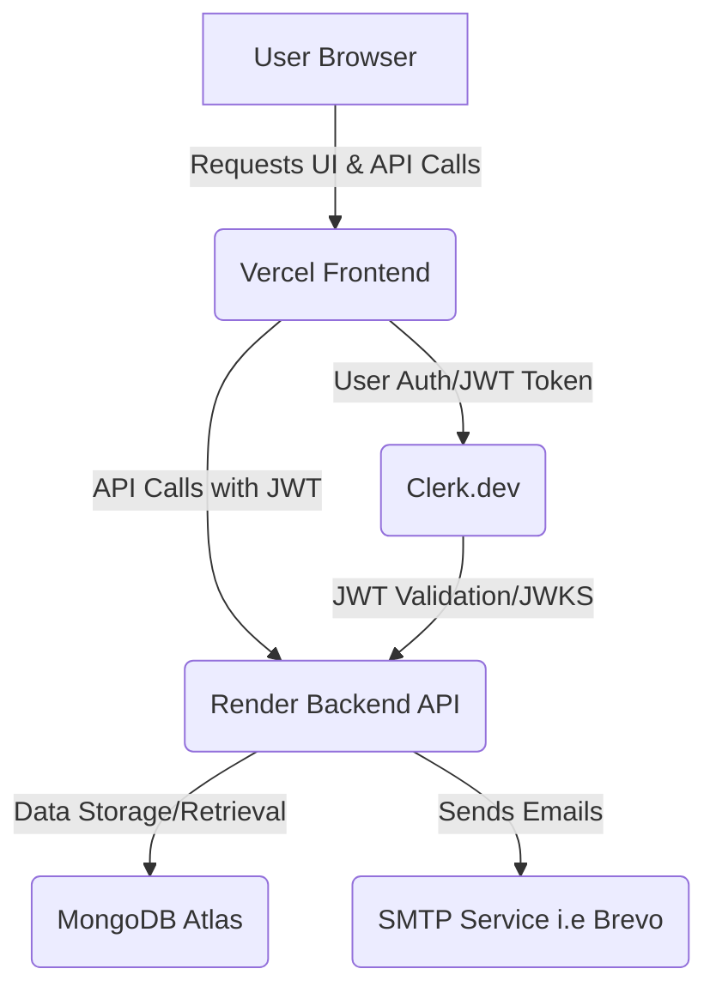

#  QuickInvoice Generator

**Modern Full-Stack Invoice Management Application**

QuickInvoice Generator is a full-stack web application designed to simplify invoice creation, management, and delivery. Built with cutting-edge technologies, it provides a seamless experience for users to:

- Generate professional invoices  
- Save Invoices
- Download PDFs
- Send invoices directly via email

---

##  Live Preview

Experience QuickInvoice Generator live:

- **URL**: https://quick-invoice-generator-seven.vercel.app/
- **Backend Repo**:https://github.com/Shrawan0701/invoice-backend

---

##  Features

✅ **Secure User Authentication**  
Seamless sign-up and login using Google OAuth, powered by Clerk.dev.

🧾 **Intuitive Invoice Creation**  
Easily create detailed invoices with multiple items, quantities, amounts, and tax calculations.

📂 **Invoice Management**  
Save, view, and retrieve past invoices securely.

📧 **Email Delivery**  
Send generated invoices directly to clients via integrated email service.

📱 **Responsive Design**  
User-friendly interface adaptable to all screen sizes.

💾 **Persistent Data Storage**  
All user and invoice data are securely stored in a MongoDB Atlas database.

---

## 🛠️ Tech Stack

### 🔹 Frontend

- **React.js** – Declarative UI components  
- **Vite** – Fast build and development tool  
- **Bootstrap** – Responsive CSS framework  
- **Clerk.dev (React SDK)** – Authentication integration  

### 🔹 Backend

- **Spring Boot** – Enterprise-grade backend framework  
- **Java** – Language used for backend development  
- **Spring Security** – API protection and JWT validation  
- **Spring Data MongoDB** – Data access layer for MongoDB  
- **Maven** – Dependency and build management  

## ☁️ Architecture

The application follows a modern, decoupled full-stack architecture:

- **Frontend (Vercel)**: React SPA that handles all user interactions and communicates with the backend via RESTful APIs.
- **Backend (Render + Docker)**: A containerized Spring Boot API that handles business logic, email delivery, and JWT-based authorization.
- **Authentication (Clerk.dev)**: Auth system for sign-up, login, and token issuance/validation.
- **Database (MongoDB Atlas)**: Stores user profiles, invoices, and related metadata.

## Contact ##
Have questions or feedback?
Feel free to reach out:

📧 Email: shrawanwandhekar@gmail.com

💼 LinkedIn: https://www.linkedin.com/in/shrawanwandhekar/
